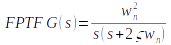
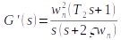
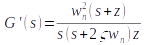
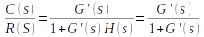
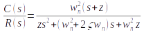

### Link your theory in here
The forward path transfer function of general second order system is given by, 

 

Addition of zero to forward path transfer function: 
When we add a zero the forward path transfer function becomes, 

 

 

 

